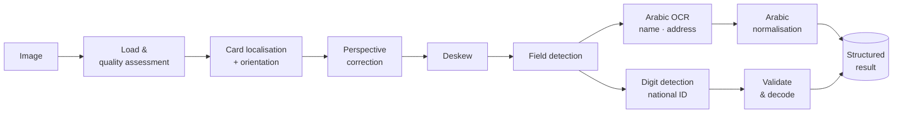
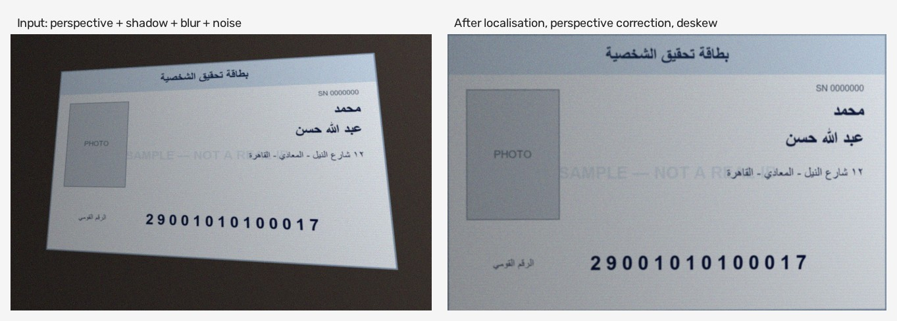

# NileID

Computer-vision and Arabic OCR pipeline for structured information extraction from Egyptian National ID cards.

[](https://github.com/ahmedsayed1911/nileid-ocr/actions/workflows/ci.yml)
[](https://www.python.org/)
[](LICENSE)
[](https://github.com/astral-sh/ruff)

NileID takes a photograph of an Egyptian National ID card and returns the
name, address and National ID number as structured data — together with a
confidence score for every field, a structural validation of the ID number,
and an explicit warning whenever something could not be read.

It is a reading tool, not a verification tool. It cannot tell you whether a
card is genuine.

---

## Why the output looks the way it does

Most OCR wrappers return a flat dictionary of strings. That hides the single
most important fact about an identity document: **whether the value can be
trusted.** An empty string might mean "the field is blank", "OCR failed", or
"the region was never found", and a 13-digit National ID looks exactly as
confident as a correct one.

NileID separates three layers and keeps all of them:

| Layer | Question it answers |
|---|---|
| `raw` | What did the OCR engine actually return? |
| `value` | What does it look like after normalisation? |
| `validation` | Does it hold up structurally? |

A field that cannot be read is `null` with a status, never a plausible guess.
Birth date, governorate and gender are decoded from the ID number and appear
**only** when that number passes validation. The pipeline never completes a
partial ID number by inference.

---

## Extracted fields

| Field | Source | Notes |
|---|---|---|
| `first_name` | OCR (Arabic) | with confidence |
| `last_name` | OCR (Arabic) | with confidence |
| `full_name` | composed | from the parts actually read |
| `address` | OCR (Arabic) | with confidence |
| `national_id` | digit detection | 14 digits; per-digit confidence |
| `birth_date` | decoded | only when the ID validates |
| `governorate` | decoded | registration governorate |
| `gender` | decoded | from digit 13 |

---

## Pipeline



Four YOLO detectors do the localisation work; EasyOCR reads Arabic text; the
National ID is read as a *detection* problem, because the digit detector's
class index is the digit value.

Full detail: **[docs/OCR_PIPELINE.md](docs/OCR_PIPELINE.md)** ·
**[docs/ARCHITECTURE.md](docs/ARCHITECTURE.md)**

### Preprocessing in practice



*A synthetic card photographed at an angle under uneven lighting, with blur
and sensor noise, then localised, perspective-corrected and deskewed by the
pipeline. Measured on synthetic fixtures: **0.5 px** mean corner error for
perspective recovery, **0.20°** worst-case residual for deskew across ±15°.*

---

## Installation

Requires Python 3.10+.

```bash
git clone https://github.com/ahmedsayed1911/nileid-ocr.git
cd nileid-ocr
python -m venv .venv
```

Activate the environment:

```bash
source .venv/bin/activate
```

On Windows PowerShell:

```powershell
.venv\Scripts\Activate.ps1
```

On a machine without an NVIDIA GPU, install the CPU build of PyTorch first —
the default wheel pulls several hundred megabytes of unused CUDA libraries:

```bash
pip install torch torchvision --index-url https://download.pytorch.org/whl/cpu
```

Then install the package and fetch the model weights:

```bash
pip install -e ".[api,demo]"
```

```bash
python scripts/download_models.py
```

Confirm the environment is ready:

```bash
nileid check
```

> The weights (~86 MB across four checkpoints) are distributed as release
> assets rather than committed, so cloning stays fast. EasyOCR downloads its
> Arabic and English language models on first use.

---

## Usage

### Python

```python
from nileid import EgyptianIDReader

reader = EgyptianIDReader()          # models load once and are reused
result = reader.read("card.jpg")

print(result.national_id.value)      # '29001010100017' or None
print(result.national_id.confidence) # 0.93
print(result.full_name.value)        # 'محمد عبد الله حسن'
print(result.birth_date)             # '1990-01-01', or None if unvalidated

if result.warnings:
    print("\n".join(result.warnings))

result.to_dict()        # full structured output
result.to_flat_dict()   # simple field -> value mapping
```

Reuse one reader across images — constructing a new one reloads every model:

```python
results = reader.read_batch(["a.jpg", "b.jpg", "c.jpg"])
```

### Command line

```bash
nileid read card.jpg
```

```bash
nileid read ./cards --json -o results.json
```

```bash
nileid validate 29001010100017
```

### HTTP API

```bash
uvicorn nileid.api.app:app --port 8000
```

```bash
curl -F "file=@card.jpg" http://localhost:8000/v1/extract
```

Interactive OpenAPI documentation is served at `http://localhost:8000/docs`. Uploads are processed in
memory, capped at 10 MB, and never written to disk.

### Demo

```bash
streamlit run demo/app.py
```

### Docker

```bash
docker build -t nileid . && docker run --rm -p 7860:7860 nileid
```

---

## Example result

This is the **verbatim output** of running the bundled synthetic sample —
not a curated best case:

```bash
nileid read examples/sample_card.png --json
```

```json
{
  "card_detected": false,
  "card_confidence": 0.0,
  "rotation_applied": 0,
  "side": null,
  "fields": {
    "first_name":  { "value": "محمل", "raw": "محمل", "confidence": 0.8559, "status": "ok" },
    "last_name":   { "value": null,  "raw": null,  "confidence": 0.0,    "status": "not_found" },
    "full_name":   { "value": "محمل", "raw": "محمل", "confidence": 0.8559, "status": "low_confidence" },
    "address":     { "value": null,  "raw": null,  "confidence": 0.0,    "status": "not_found" },
    "national_id": { "value": "555", "raw": "555", "confidence": 0.3464, "status": "low_confidence" }
  },
  "derived": {
    "birth_date": null,
    "governorate": null,
    "gender": null
  },
  "validation": {
    "valid": false,
    "length_ok": false,
    "checksum_ok": null,
    "date_ok": false,
    "governorate_ok": false,
    "errors": ["expected 14 digits, found 3"]
  },
  "warnings": [
    "low contrast (std=31)",
    "image is overexposed",
    "No ID card outline was detected; processing the image as if it were already cropped to the card.",
    "The detector flagged these regions as atypical for a genuine card: nid, serial. They were still read.",
    "Read 3 of 14 National ID digits; the number is incomplete and has not been completed by inference.",
    "Birth date, governorate and gender were not derived because the National ID did not pass validation."
  ],
  "processing_time_ms": 6152.0
}
```

**Read that output carefully — it is the whole argument for this design.**

The detectors were trained on genuine cards; the bundled sample is a
synthetic mock-up with the right layout but the wrong typeface, no security
printing and no photograph. So the pipeline does badly on it, and every
single failure is *stated*:

- the card outline was not found, and it says which fallback it used;
- two fields are `null` with `status: "not_found"` — not empty strings;
- the National ID came back as 3 digits, and it was **not** padded,
  completed or guessed at;
- because the number did not validate, `birth_date`, `governorate` and
  `gender` stayed `null` rather than being derived from a bad number;
- `first_name` reads `محمل` instead of `محمد` — a genuine OCR error, shown
  with its confidence rather than silently corrected to a common name.

The predecessor to this code returned `{"national_id": "559554555", ...}`
with no indication that anything had gone wrong. Making failure visible was
the primary goal of the rewrite. Expect substantially better field recovery
on real cards — but that is not something this repository can demonstrate
without collecting real identity documents, so it is not claimed. See
[docs/LIMITATIONS.md](docs/LIMITATIONS.md).

---

## National ID structure

```
2  90  01  01  01  0001  7
│  │   │   │   │   │     └─ check digit (advisory — algorithm unpublished)
│  │   │   │   │   └─────── sequence; digit 13 odd → male, even → female
│  │   │   │   └─────────── governorate code
│  │   │   └─────────────── day
│  │   └─────────────────── month
│  └─────────────────────── year (last two digits)
└────────────────────────── century: 2 → 1900s, 3 → 2000s
```

Length, century, date validity, future-date rejection and governorate code
are all checked and reported independently, so "OCR dropped a digit" is
distinguishable from "this date cannot exist".

---

## Project structure

```
src/nileid/
├── config.py          Settings — every threshold in one place
├── results.py         Typed output: Field, Status, IDCardResult
├── models.py          Lazy, process-wide model registry
├── preprocessing/     Loading, quality, enhancement, geometry
├── detection/         Card, field and digit detectors
├── ocr/               EasyOCR / PaddleOCR adapters + ensemble
├── extraction/        Arabic normalisation, optional lexicon
├── validation/        National ID structure and decoding
├── pipeline/          Stage orchestration
└── api/               FastAPI service
demo/                  Streamlit demo
docs/                  Architecture, pipeline, privacy, limitations
examples/              Synthetic sample cards
scripts/               Model download, sample generation
tests/                 253 tests
```

---

## Development

```bash
pip install -e ".[dev,api,demo]"
```

```bash
pytest
```

```bash
ruff check src tests scripts demo && ruff format --check src tests scripts demo
```

Tests that need the YOLO weights are marked `models` and skip cleanly when
the weights are absent, so CI runs the full logic suite without them:

```bash
pytest -m "not models"
```

The suite covers National ID validation and decoding, Arabic normalisation,
image loading and malformed input, preprocessing geometry (with quantitative
deskew and perspective assertions), detection post-processing, the result
schema, API upload guards, and repository hygiene.

---

## Privacy

This project processes identity documents. Please read
**[docs/PRIVACY.md](docs/PRIVACY.md)** before using it.

- Images are processed **in memory**; nothing is persisted by the library,
  the API or the demo.
- The API logs upload size and MIME type only — never filenames, never
  extracted values.
- **Never commit real ID images, ID numbers or extracted personal data.**
  The `.gitignore` is deliberately broad and a test fails the build if such
  artefacts are ever staged.
- Every image in this repository is produced by
  `scripts/make_sample_card.py`: invented placeholder content, a visible
  `SAMPLE — NOT A REAL ID` watermark, and a placeholder ID number issued to
  nobody.

If you deploy this, you are responsible for having a lawful basis, securing
the endpoint (the bundled API has no authentication), and minimising
retention.

---

## Limitations

No end-to-end accuracy figure is published, and one would be fabricated if it
were: measuring it honestly requires a labelled corpus of real ID cards,
which this project deliberately does not collect. Front side only; deskew
covers ±20°; Arabic OCR is the weakest stage; the check digit is advisory
because the official algorithm is unpublished; and the tool performs no
authenticity verification whatsoever.

Full detail: **[docs/LIMITATIONS.md](docs/LIMITATIONS.md)**.

---

## License

[MIT](LICENSE) for the source code in this repository.

The four YOLO checkpoints distributed as release assets are third-party
artefacts and are **not** covered by this licence; they are redistributed for
convenience and are not authored here. NileID also builds on
[Ultralytics YOLO](https://github.com/ultralytics/ultralytics) (AGPL-3.0),
[EasyOCR](https://github.com/JaidedAI/EasyOCR) (Apache-2.0),
[OpenCV](https://opencv.org/) (Apache-2.0) and
[PyTorch](https://pytorch.org/) (BSD-3-Clause). If you redistribute a
derivative, check Ultralytics' AGPL terms against your use case.

See [NOTICE](NOTICE) for the full third-party component list.

This is an independent open-source project. It is not affiliated with,
endorsed by, or connected to any Egyptian government body.
