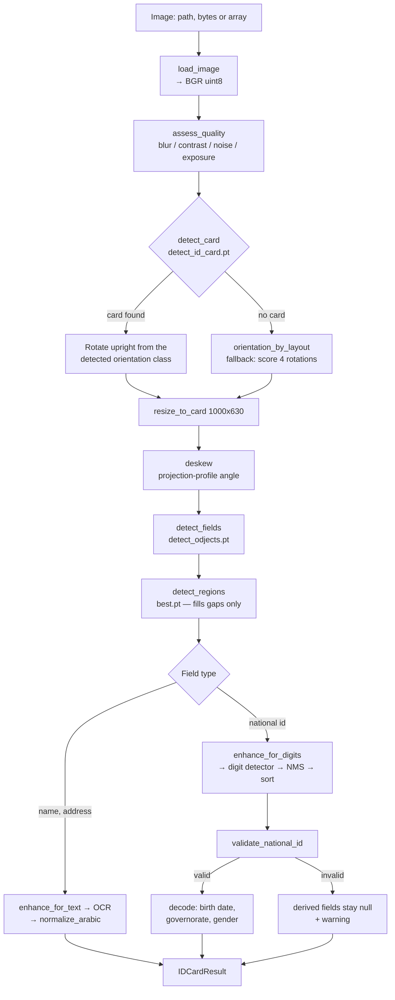

# Architecture

NileID is a staged pipeline. Each stage has one job, a typed input and a
typed output, and is independently testable. The orchestration lives in
`nileid.pipeline.reader.EgyptianIDReader`; no stage calls another directly.

## Package layout

```
src/nileid/
├── config.py          Settings dataclass — every threshold in one place
├── results.py         Typed output: Field, Status, IDCardResult
├── models.py          Lazy, process-wide model registry
├── logging_utils.py   Namespaced loggers; no basicConfig in library code
├── cli.py             Command-line entry point
├── preprocessing/
│   ├── image_io.py    Load path/bytes/array → contiguous BGR uint8
│   ├── enhance.py     Quality measurement and conditional enhancement
│   └── geometry.py    Perspective correction, deskew, rotation
├── detection/
│   ├── card.py        Card localisation + orientation
│   ├── fields.py      Field regions, class-name canonicalisation
│   └── digits.py      National ID digits, NMS, ordering
├── ocr/
│   └── engines.py     EasyOCR / PaddleOCR adapters and the ensemble
├── extraction/
│   ├── arabic.py      Unicode normalisation, orthographic repair
│   └── lexicon.py     Optional dictionary-assisted correction
├── validation/
│   ├── national_id.py Structure, date, checksum, decoding
│   └── governorates.py Governorate code table
├── pipeline/
│   └── reader.py      Stage orchestration and failure policy
└── api/
    └── app.py         FastAPI service
```

## Data flow



## Models

Four YOLO checkpoints, loaded lazily and cached per `(key, device)`.

| Key | File | Classes | Role |
|---|---|---|---|
| `card` | `detect_id_card.pt` | 8 | Locates the card and reports side + orientation (`front-up`, `back-left`, …) |
| `fields` | `detect_odjects.pt` | 31 | Primary field regions, with `invalid_*` variants for atypical cards |
| `regions` | `best.pt` | 7 | Secondary region detector; fills fields the primary missed |
| `digits` | `detect_id.pt` | 10 | Detects each National ID digit; the class index *is* the digit |

The weights are third-party artefacts distributed as release assets, not
repository content. See [the model note](#model-provenance) below.

## Design decisions

### Orientation comes from the card detector

`detect_id_card.pt` encodes orientation in its class names, so a single
inference yields both the card box and the rotation needed to stand it
upright. The brute-force alternative — running the field detector on all
four rotations and scoring the layout — is retained only as a fallback for
images where no card box is found.

### Class names are read from the model, never hard-coded

Every detector is queried through `prediction.names`. A hard-coded index →
name table silently rots the moment a checkpoint is retrained with a
different class order, and the failure is invisible: the code keeps running
and simply stops matching anything.

### `invalid_*` classes are read, not discarded

The field detector marks regions it considers atypical by prefixing the
class name. Treating those as "no detection" makes an unusual-but-legible
card return an entirely empty result with no explanation. Instead both
variants map to the same canonical field, and the suspicion surfaces as a
warning.

### Enhancement is conditional

`assess_quality` measures blur, contrast, noise and exposure; each
enhancement step runs only when its measurement calls for it. An
unconditional chain wastes time on clean crops and damages them —
morphological closing merges adjacent Arabic strokes, and denoising erodes
thin diacritics.

### Three layers are kept distinct

`raw` (what OCR returned), `value` (normalised) and `validation` (structural
checks) are all present in the output. Collapsing them hides whether a
field is wrong because OCR misread it or because normalisation mangled it.

### Nothing is invented

A field that cannot be read is `None` with a status, never a plausible
guess. Birth date, governorate and gender are derived from the National ID
number and are populated only when that number passes validation.

## Model provenance

The four YOLO checkpoints were trained separately and are redistributed as
release assets. They are **not** authored as part of this repository's
source, and the MIT licence covering this code does not extend to them.
`scripts/download_models.py` fetches them; `docs/LIMITATIONS.md` records
what they were trained on and where that constrains accuracy.
